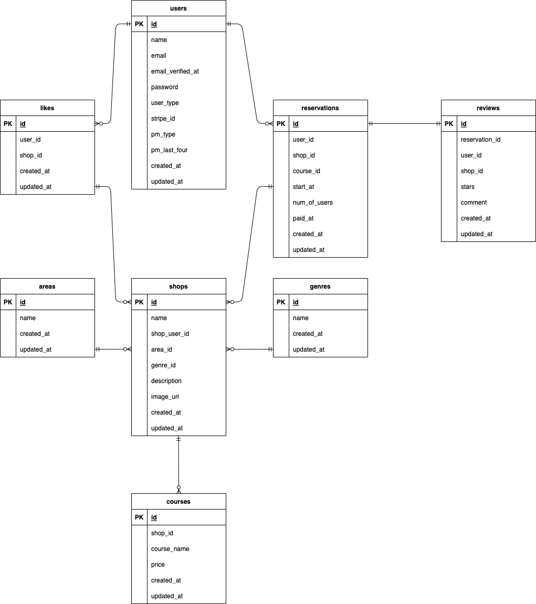

# アプリケーション名
サービズ名：Rese(リーズ)
飲食店予約サービス

## 作成した目的
外部の飲食店予約サービスは手数料を取られるので自社で予約サービスを持ちたい。
制作目標として、初年度でのユーザー数10,000人達成すること。

## アプリケーションURL
http://127.0.0.1:8000/

## 機能一覧

- 会員登録機能
- ログイン機能
- ログアウト機能
- メール認証機能
- ユーザー情報取得機能
- ユーザー飲食店お気に入り一覧取得機能
- ユーザー飲食店予約情報取得機能
- 飲食店一覧取得機能
- 飲食店詳細取得機能
- 飲食店お気に入り追加機能
- 飲食店お気に入り削除機能
- 飲食店予約情報追加機能
- 飲食店予約情報削除機能
- 飲食店予約情報更新機能
- 飲食店評価機能
- エリア検索機能
- ジャンル検索機能
- 店名検索機能
- バリデーション
- レスポンシブデザイン：ブレイクポイント768px
- 管理者管理画面
- 店舗代表者作成機能
- メール送信機能
- 店舗代表者管理画面
- 店舗作成機能
- 店舗更新機能
- コース作成機能
- コース更新機能
- リマインダーメール機能
- QRコード
- 決済機能

## 使用技術(実行環境)
- PHP 8.2.0
- Laravel Framework 8.83.27
- mysql 5.7.34
- MAMP 6.6
- Laravel Breeze 1.9.0
- guzzlehttp/guzzle 7.5.1
- laravel/cashier 13.17.0

## テーブル設計

## ER図

# 環境構築
他の人でもプロジェクトを実行できるようコマンドや編集ファイルを記載する
1.下記urlよりMAMPをインストールする
https://www.mamp.info/en/downloads/

2.MAMPのPreferencesより初期設定をする
- 「Ports」を開き、「80＆3306」ボタンをクリックし、OKボタンをクリック

3.ターミナルにて、下記コマンドを実行する
cd /Applications/MAMP/Library/bin/

4.同様に「./mysql -u root -p」コマンドを実行し、パスワードを求められると「root」と入力する

5.mysqlにて、下記のコマンドを実行する
create database advance_term_project

6.データベースが作成できたので、「exit;」コマンドでmysqlを終了する

7.ターミナルにて、下記のコマンドを実行する
/bin/bash -c "$(curl -fsSL https://raw.githubusercontent.com/Homebrew/install/HEAD/install.sh)"

8.７にてHomebrewのインストールが完了すると、「brew install composer」のコマンドを実行し、composerをインストールする

9.composerのインストールが完了すると、下記のコマンドを実行する
cd /Applications/MAMP/htdocs/

10.9が完了すると、「git clone https://github.com/ameji1077/advance-term-project.git」のコマンドを実行し、リポジトリを複製する
- README.mdのみが表示される場合、「git checkout main」のコマンドを実行する

11.完了すると下記コマンドをそれぞれ実行する
- composer require laravel/breeze --dev
- composer require guzzlehttp/guzzle
- composer require laravel/cashier

12.「php artisan migrate」と「php artisan db:seed」のコマンドを実行し、テーブルとそれぞれのデータを作成する

13.外部サービスとして、「mailtrap」と「Stripe」のアカウントを取得する

14..envファイルの下記の箇所をStripeのそれぞれのAPIキーに変更する
- STRIPE_KEY=
- STRIPE_SECRET=
- STRIPE_WEBHOOK_SECRET=

15.php artisan serveを実行しひょうじされたurlよりブラウザで確認する

## アカウントの種類(テストユーザーなど)
一般ユーザーアカウント
- ユーザー名：test-user
- メールアドレス：test.user@example.com
- パスワード：test-user-001

アドミンユーザーアカウント
- ユーザー名：test-admin
- メールアドレス：test.admin@example.com
- パスワード：test-admin-001

店舗ユーザーアカウント
- ユーザー名：test-shop
- メールアドレス：test.shop@example.com
- パスワード：test-shop-001

- ユーザー名：店舗作成用
- メールアドレス：test.shop.02@example.com
- パスワード：test-shop-002